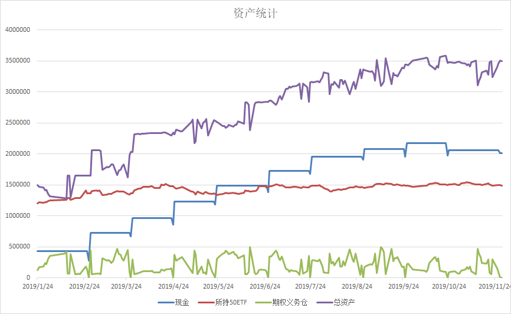

# Covered Call Strategy: Shanghai Stock Exchange China 50 ETF & Backtesting

## Strategy Description
A covered call is a strategy composed of an call options contract collateralized by the equivalent amount of the underlying security. In this simple example, the underlying security is the China 50 ETF (510050). The call options considered here are European-style at-the-money options held until expiration. Options expire on the fourth Wednesday of the month. The strategy goes as follows.
On the day following the first expiration date of the year, we construct a covered position, viz, a long position in the underlying and a short position in the equivalent amount of at-the-money options expiring next month. Then, in each subsequent month on the expiration date, we close the short position by buying back the options and on the next trading day, construct a new short position of at-the money call options expiring the next month.

 ## Details
 The original capital equals CNY 1,500,000

 Transaction fee is accounted for and is at CNY 5 per contract

 We trade 50 contracts each time.

 Every contract comprises 10,000 options

 Slippage is assumed to equal CNY 5 per contract

 ##  Result

 
